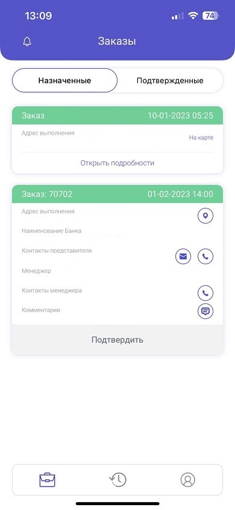
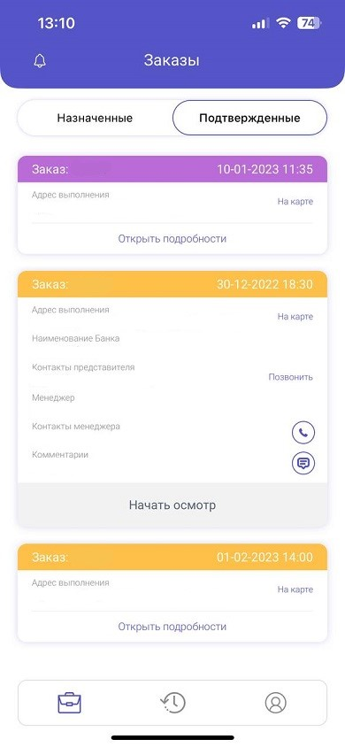
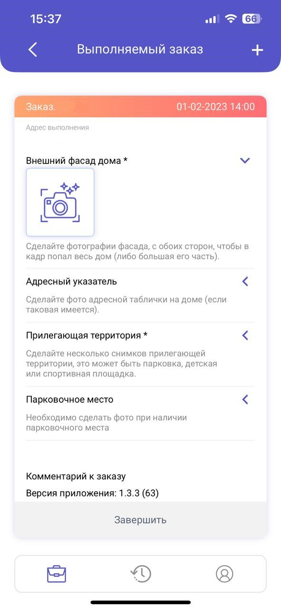
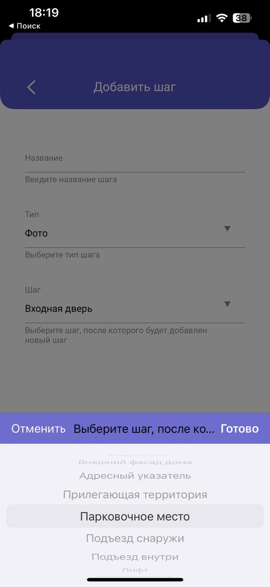
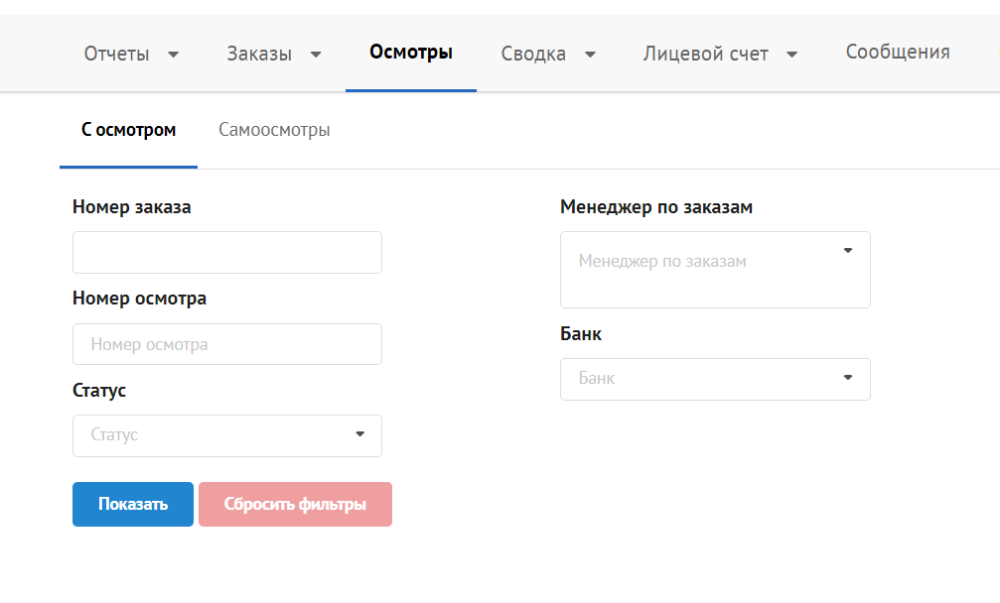
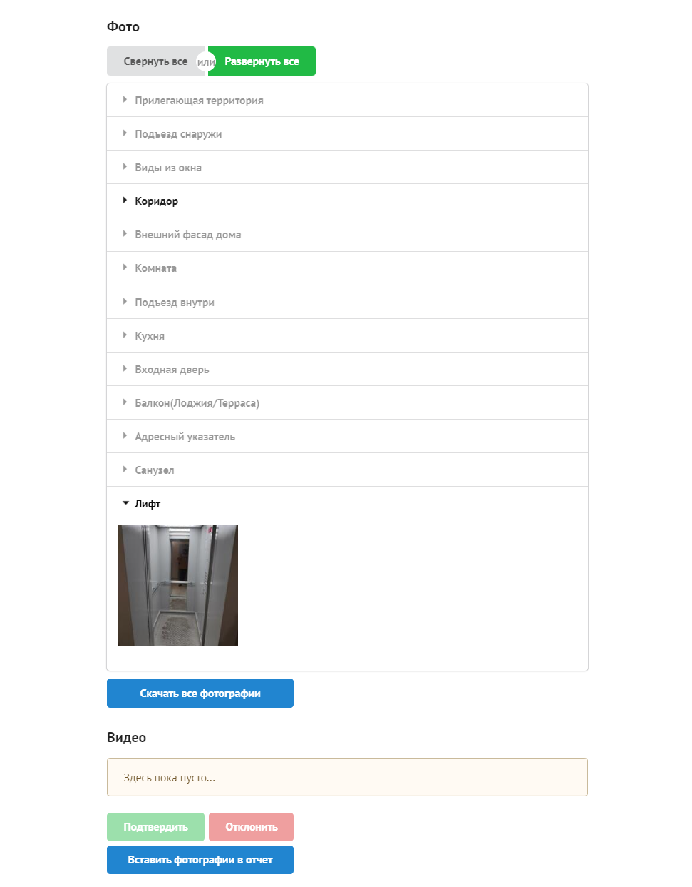

+++
title = "Проведение Осмотра"
description = ""
weight = 2
+++
После [установки и входа]() в приложение можно перейти к проведению осмотра.
### Принятие задания
После входа в приложение на экране будут отражены все назначенные на вас заказы.

Вы можете нажать "Открыть подробности" и ознакомится с деталями проведения осмотра.
 Выберите необходимый заказ и нажмите "Подтвердить"
После подтверждения заказа, задание на осмотр   автоматически переходит в раздел "Потвержденные"

### Проведение осмотра 
Нажмите "Начать осмотр" и начните проводить осмотр.
 У вас раскроется панель, выполняемого заказа с перечислением всех разделов.
 Сделайте фото во всех обязательных разделах, отмеченных звёздочкой(*).
Чтобы добавить дополнить раздел в осмотр, нажмите "+" в верхнем правом углу, у вас откроется страница, где необходимо написать название шага и выбрать его местоположение.

### Завершение осмотра

После того, как вы сделали все необходимые фотографии, нажмите "Завершить" и дождитесь загрузки данных на сервер.
 Осмотр будет завершен, он перейдет во вкладку "История" со статусом "На проверке Оценщика".
На данном этапе необходимо зайти в Банк-Оценщик во вкладку "Осмотры"

 

 Найдите нужный осмотр по номеру заказа, проверьте, что все фото загружены и удалите лишние.
 
После проверки нажмите "Вставить фотографии в отчет"

 

 В приложении статус заказ сменится на "Завершен".